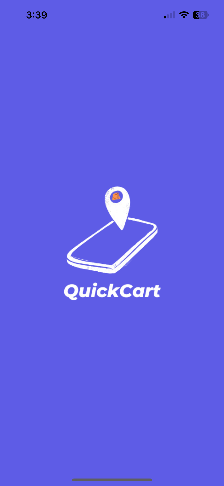
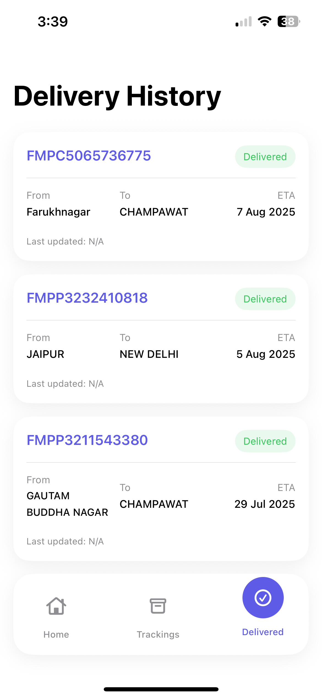
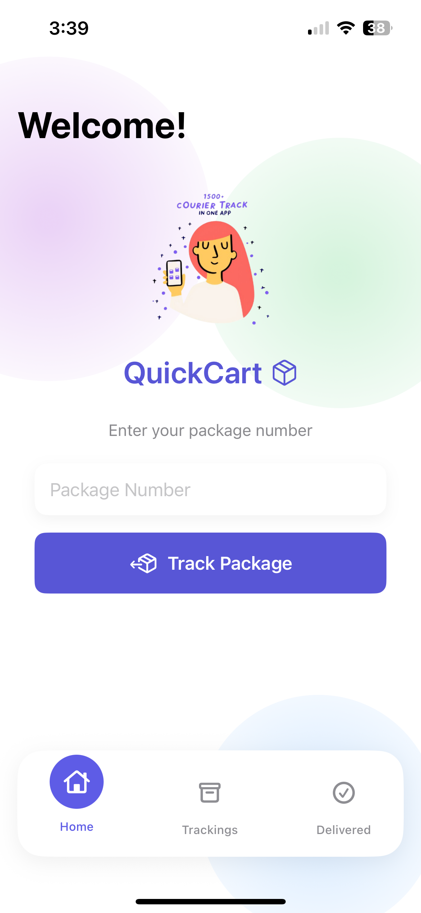
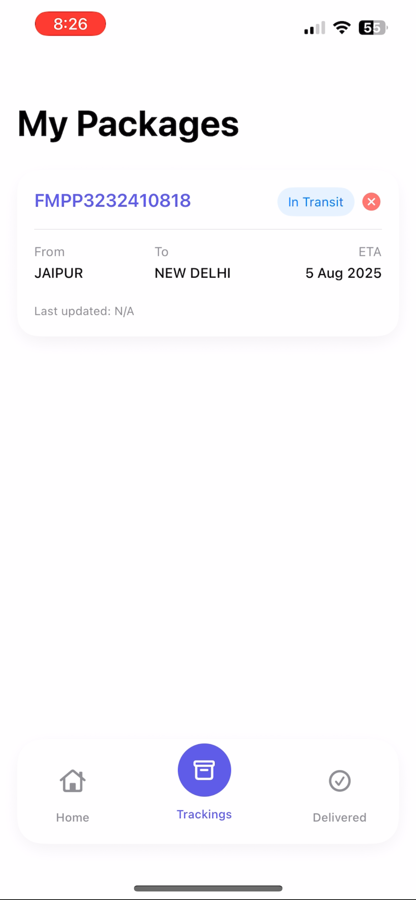
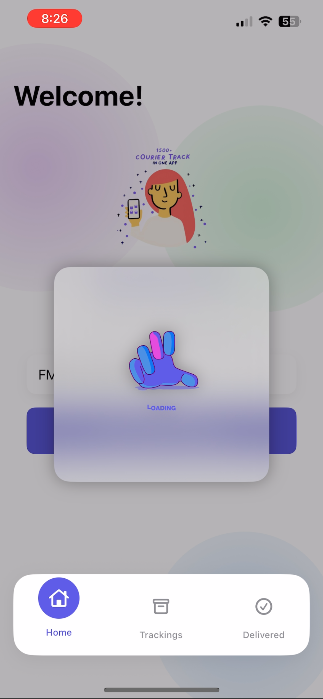
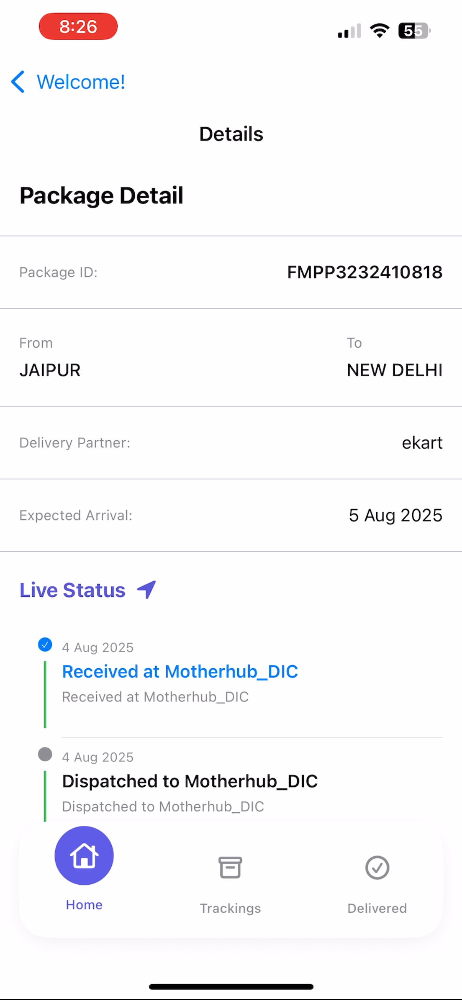

# QuickyCart App

**QuickyCart** is a SwiftUI app that lets users quickly add products to their cart and track prices.  
Users can browse products, add them to the cart, view totals, and get notified about price changes.

---

## 🖼️ Screenshots

---

## 🚀 Features

- Quick add products to cart  
- View total price and product details  
- Price drop alerts and notifications  
- Clean SwiftUI interface with dark mode  
- Automatic real-time product tracking  

---

## 🛠️ Tech Stack

**Frontend (QuickyCart)**  
- Swift, SwiftUI, Lottie  

**Backend**  
- Real-time product tracking (API hidden)  
- No custom backend required  

---

## 💻 How to Run

### Frontend (`QuickyCart`)
1. Open `QuickyCart` folder in Xcode  
2. Build and run  
3. App will automatically fetch product info and show notifications
